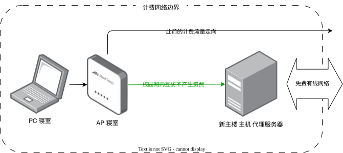

> 事情是这样的...
> 这天试图在寝室的电脑下游戏，两个笑死被吃了 100 GB 的流量过于心疼，于是想了各种方法来偷学校的流量

## 使用网络代理经过固定主机访问互联网

学校的网络按流量计费，但工位所在的有线网络环境是免费的；此外，学校的所有无线网络地址彼此隔离无法互访，但工位分到的有线地址可以被无线或有线局域网内的任何地址访问。

在有一天无聊地输入 https_proxy="xxx" 时想到，可以在工位的固定主机上开设网络代理服务器并允许局域网内地址访问传入，从而代理局域网内所有的流量到互联网。

实现这个效果主要需要做这几件事：

1. 服务器端：需要启动代理服务器，并允许局域网内地址访问传入（不可说）
2. 客户端：在对应设置项中设置 http, https 代理地址、端口。对于 macOS 而言，在对应网络 - 详细信息 - 代理中设置；对 windows 而言，在网络和 Internet - 代理 - 手动设置代理中设置

可通过在客户端浏览器访问校园网认证页面验证抓取的上网 IP 是否是工位的 IP 来确认是否成功

### 注意 windows 代理设置不是全局

但是一定要注意 windows 的代理设置不是全局的，例如如果是 Epic 的话需要从 头像 - 设置 - 使用代理服务器 中设置。（你猜为什么我发现了）

## 通过校园网 VPN 访问固定主机对应端口服务

这就解决了 [部署 overleaf](/260402-overleaf) 这一篇中遇到的远程访问问题。当我发现工位有线网分到的内网 IP 可以在局域网内自由访问时，就想到可以通过学校的 VPN 页面访问 IP:port 来使用工位的服务了。不赘述。